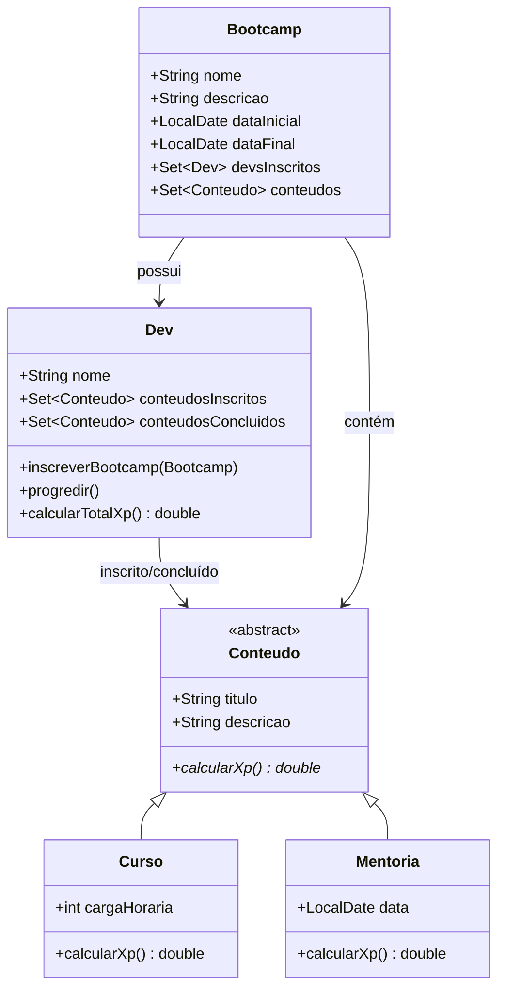

# 🚀 Bootcamp Java Developer - Sistema de Gestão

<div align="center">


**Sistema completo de gestão de bootcamp com Programação Orientada a Objetos**

[](https://github.com/Dev-RuiDiniz/desafio-poo-dio)
[](https://github.com/Dev-RuiDiniz/desafio-poo-dio)

</div>

---

## 📋 Índice

- [🎯 Sobre o Projeto](#-sobre-o-projeto)
- [🏗️ Arquitetura do Sistema](#️-arquitetura-do-sistema)
- [🔧 Tecnologias Utilizadas](#-tecnologias-utilizadas)
- [📚 Conceitos de POO Aplicados](#-conceitos-de-poo-aplicados)
- [🚀 Como Executar](#-como-executar)
- [📖 Documentação das Classes](#-documentação-das-classes)
- [🎮 Demonstração do Sistema](#-demonstração-do-sistema)
- [📊 Estrutura do Projeto](#-estrutura-do-projeto)
- [🤝 Contribuindo](#-contribuindo)
- [📄 Licença](#-licença)

---

## 🎯 Sobre o Projeto

Este projeto implementa um **sistema completo de gestão de bootcamp** utilizando os pilares fundamentais da **Programação Orientada a Objetos (POO)**. O sistema permite:

- ✅ Gerenciar bootcamps com múltiplos conteúdos
- ✅ Inscrever desenvolvedores em bootcamps
- ✅ Controlar progressão dos desenvolvedores
- ✅ Calcular experiência (XP) baseada em conteúdos concluídos
- ✅ Suporte a diferentes tipos de conteúdo (Cursos e Mentorias)

### 🎓 Objetivos de Aprendizado

- **Abstração**: Modelagem do domínio do problema
- **Encapsulamento**: Proteção e controle de acesso aos dados
- **Herança**: Reutilização de código através de hierarquias
- **Polimorfismo**: Flexibilidade através de interfaces comuns

---

## 🏗️ Arquitetura do Sistema



---

## 🔧 Tecnologias Utilizadas

- **Java 11+** - Linguagem de programação
- **IntelliJ IDEA** - IDE de desenvolvimento
- **Git** - Controle de versão
- **Maven/Gradle** - Gerenciamento de dependências

---

## 📚 Conceitos de POO Aplicados

### 🔺 Abstração
- Classe abstrata `Conteudo` define a estrutura comum
- Método abstrato `calcularXp()` implementado diferentemente em cada subclasse

### 🔺 Encapsulamento
- Atributos privados com getters/setters
- Métodos públicos para interação controlada
- Proteção de dados internos das classes

### 🔺 Herança
- `Curso` e `Mentoria` herdam de `Conteudo`
- Reutilização de código comum
- Especialização de comportamentos

### 🔺 Polimorfismo
- Método `calcularXp()` com implementações diferentes
- Tratamento uniforme de diferentes tipos de conteúdo
- Flexibilidade na adição de novos tipos

---

## 🚀 Como Executar

### Pré-requisitos
- ✅ Java JDK 11 ou superior
- ✅ IDE Java (IntelliJ IDEA, Eclipse, VS Code)
- ✅ Git

### Passos para Execução

1. **Clone o repositório**
```bash
git clone https://github.com/Dev-RuiDiniz/desafio-poo-dio.git
cd desafio-poo-dio
```

2. **Abra o projeto na sua IDE**
```bash
# IntelliJ IDEA
File → Open → selecione a pasta do projeto
```

3. **Execute a classe Main**
```bash
# Via IDE: Run Main.java
# Via terminal:
javac -cp src src/Main.java
java -cp src Main
```

### 📋 Saída Esperada
```
Conteúdos Inscritos Camila:[Curso{titulo='curso java', descricao='descrição curso java', cargaHoraria=8}, Curso{titulo='curso js', descricao='descrição curso js', cargaHoraria=4}, Mentoria{titulo='mentoria de java', descricao='descrição mentoria java', data=2024-01-15}]
-
Conteúdos Inscritos Camila:[Curso{titulo='curso js', descricao='descrição curso js', cargaHoraria=4}, Mentoria{titulo='mentoria de java', descricao='descrição mentoria java', data=2024-01-15}]
Conteúdos Concluídos Camila:[Curso{titulo='curso java', descricao='descrição curso java', cargaHoraria=8}]
XP:80.0
-------
Conteúdos Inscritos João:[Curso{titulo='curso java', descricao='descrição curso java', cargaHoraria=8}, Curso{titulo='curso js', descricao='descrição curso js', cargaHoraria=4}, Mentoria{titulo='mentoria de java', descricao='descrição mentoria java', data=2024-01-15}]
-
Conteúdos Inscritos João:[]
Conteúdos Concluidos João:[Curso{titulo='curso java', descricao='descrição curso java', cargaHoraria=8}, Curso{titulo='curso js', descricao='descrição curso js', cargaHoraria=4}, Mentoria{titulo='mentoria de java', descricao='descrição mentoria java', data=2024-01-15}]
XP:150.0
```

---

## 📖 Documentação das Classes

### 🏛️ Conteudo (Classe Abstrata)
```java
/**
 * Classe abstrata que representa um conteúdo educacional
 * Esta é a classe base para todos os tipos de conteúdo (Cursos, Mentorias, etc.)
 * Define a estrutura comum que todos os conteúdos devem ter
 */
public abstract class Conteudo {
    protected static final double XP_PADRAO = 10d;
    private String titulo;
    private String descricao;
    public abstract double calcularXp();
}
```

### 📚 Curso
```java
/**
 * Classe que representa um Curso
 * Herda de Conteudo e implementa a lógica específica para cursos
 * O XP de um curso é calculado multiplicando o XP_PADRAO pela carga horária
 */
public class Curso extends Conteudo {
    private int cargaHoraria;
    
    @Override
    public double calcularXp() {
        return XP_PADRAO * cargaHoraria;
    }
}
```

### 🎓 Mentoria
```java
/**
 * Classe que representa uma Mentoria
 * Herda de Conteudo e implementa a lógica específica para mentorias
 * O XP de uma mentoria é fixo: XP_PADRAO + 20 pontos extras
 */
public class Mentoria extends Conteudo {
    private LocalDate data;
    
    @Override
    public double calcularXp() {
        return XP_PADRAO + 20d;
    }
}
```

### 👨‍💻 Dev (Desenvolvedor)
```java
/**
 * Classe que representa um Desenvolvedor (Dev)
 * Gerencia os conteúdos inscritos e concluídos pelo desenvolvedor
 * Calcula o XP total baseado nos conteúdos concluídos
 */
public class Dev {
    private String nome;
    private Set<Conteudo> conteudosInscritos = new LinkedHashSet<>();
    private Set<Conteudo> conteudosConcluidos = new LinkedHashSet<>();
    
    public void inscreverBootcamp(Bootcamp bootcamp);
    public void progredir();
    public double calcularTotalXp();
}
```

### 🏕️ Bootcamp
```java
/**
 * Classe que representa um Bootcamp
 * Um bootcamp possui um conjunto de conteúdos e desenvolvedores inscritos
 * Tem duração fixa de 45 dias a partir da data de criação
 */
public class Bootcamp {
    private String nome;
    private String descricao;
    private final LocalDate dataInicial = LocalDate.now();
    private final LocalDate dataFinal = dataInicial.plusDays(45);
    private Set<Dev> devsInscritos = new HashSet<>();
    private Set<Conteudo> conteudos = new LinkedHashSet<>();
}
```

---

## 🎮 Demonstração do Sistema

### 📝 Fluxo Principal

1. **Criação de Conteúdos**
   - Criação de cursos com carga horária específica
   - Criação de mentorias com data agendada

2. **Formação do Bootcamp**
   - Adição de conteúdos ao bootcamp
   - Definição de nome e descrição

3. **Inscrição de Desenvolvedores**
   - Desenvolvedores se inscrevem no bootcamp
   - Todos os conteúdos são adicionados aos inscritos

4. **Progressão**
   - Desenvolvedores progridem nos conteúdos
   - Conteúdos são movidos de "inscritos" para "concluídos"
   - XP é calculado baseado nos conteúdos concluídos

### 🧮 Cálculo de XP

| Tipo de Conteúdo | Fórmula | Exemplo |
|------------------|---------|---------|
| **Curso** | `XP_PADRAO × cargaHoraria` | 8h = 80 XP |
| **Mentoria** | `XP_PADRAO + 20` | Fixo = 30 XP |

---

## 📊 Estrutura do Projeto

```
desafio-poo-dio/
├── src/
│   ├── Main.java                           # Classe principal com demonstração
│   └── br/com/dio/desafio/dominio/
│       ├── Conteudo.java                  # Classe abstrata base
│       ├── Curso.java                     # Implementação de curso
│       ├── Mentoria.java                  # Implementação de mentoria
│       ├── Dev.java                       # Classe do desenvolvedor
│       └── Bootcamp.java                  # Classe do bootcamp
├── out/                                   # Arquivos compilados (.class)
├── README.md                              # Este arquivo
└── desafio-poo-dio.iml                    # Configuração do IntelliJ
```

---

## 🎯 Funcionalidades Implementadas

### ✅ Gestão de Conteúdos
- [x] Criação de cursos com carga horária
- [x] Criação de mentorias com data
- [x] Cálculo automático de XP por tipo

### ✅ Gestão de Bootcamp
- [x] Criação de bootcamp com duração fixa (45 dias)
- [x] Adição de múltiplos conteúdos
- [x] Controle de desenvolvedores inscritos

### ✅ Gestão de Desenvolvedores
- [x] Inscrição em bootcamps
- [x] Progressão sequencial nos conteúdos
- [x] Cálculo de XP total acumulado
- [x] Controle de conteúdos inscritos vs concluídos

### ✅ Recursos Técnicos
- [x] Documentação JavaDoc completa
- [x] Comentários explicativos em todo código
- [x] Implementação dos 4 pilares da POO
- [x] Estrutura de dados otimizada (LinkedHashSet, HashSet)

---

## 🚀 Melhorias Futuras

### 🔮 Funcionalidades Planejadas
- [ ] Sistema de certificados
- [ ] Ranking de desenvolvedores
- [ ] Notificações de progresso
- [ ] Interface gráfica (Swing/JavaFX)
- [ ] Persistência em banco de dados
- [ ] API REST para integração

### 🛠️ Melhorias Técnicas
- [ ] Testes unitários (JUnit)
- [ ] Logging estruturado
- [ ] Validação de dados
- [ ] Tratamento de exceções
- [ ] Padrões de design (Factory, Builder)

---

## 🤝 Contribuindo

Contribuições são sempre bem-vindas! Para contribuir:

1. **Fork** o projeto
2. **Crie** uma branch para sua feature (`git checkout -b feature/AmazingFeature`)
3. **Commit** suas mudanças (`git commit -m 'Add some AmazingFeature'`)
4. **Push** para a branch (`git push origin feature/AmazingFeature`)
5. **Abra** um Pull Request

### 📋 Padrões de Contribuição
- Siga as convenções de código Java
- Adicione comentários para código complexo
- Mantenha a documentação atualizada
- Teste suas alterações antes de submeter

---

## 📄 Licença

Este projeto está sob a licença MIT. Veja o arquivo [LICENSE](LICENSE) para mais detalhes.

---

## 👥 Autores

- **Rui Diniz** - *Desenvolvimento e Documentação* - [GitHub](https://github.com/Dev-RuiDiniz)
- **Repositório Oficial** - [`Dev-RuiDiniz/desafio-poo-dio`](https://github.com/Dev-RuiDiniz/desafio-poo-dio)
- **Digital Innovation One** - *Conceito Original* - [DIO](https://web.digitalinnovation.one/)

---

## 🙏 Agradecimentos

- [Digital Innovation One](https://web.digitalinnovation.one/) pela oportunidade de aprendizado
- Comunidade Java pela troca de conhecimento
- Todos os desenvolvedores que contribuíram com feedback

---

<div align="center">

**⭐ Se este projeto te ajudou, considere dar uma estrela! ⭐**

[](https://github.com/Dev-RuiDiniz/desafio-poo-dio)
[](https://github.com/Dev-RuiDiniz/desafio-poo-dio)

---

**Desenvolvido com ❤️ para a comunidade Java**

</div>